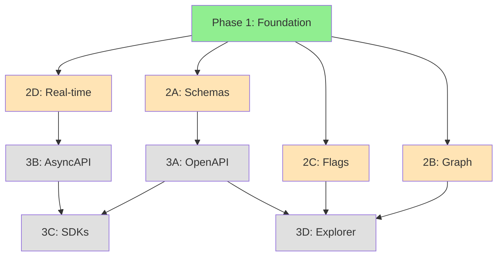

# 🗺️ Perplexity SPA Reverse Engineering — Roadmap

## 🏁 Phase 1: Foundation ✅ **COMPLETE**

### Status: ✅ Complete (22 Jan 2026)

### Deliverables

| Task | Status | Output |
|------|--------|--------|
| **1.1** Extract endpoints from HAR | ✅ | 404 REST + 14 SSE |
| **1.2** Decompress all JS sources | ✅ | 397 modules (gzipped) |
| **1.3** Build unified spec | ✅ | `perplexity_spa_full_spec.json` |
| **1.4** Create CLI analyzer | ✅ | `spec_analyzer.py` (4 commands) |
| **1.5** Write documentation | ✅ | 2,500+ lines |

### Metrics

```
✅ Endpoints:         404 REST (53 categories)
✅ SSE Streams:       14+
✅ Source Modules:    397 (3.37 MB → 1.2 MB gzip)
✅ React Hooks:       195+ identified
✅ CLI Commands:      4 (analyze, feature-map, openapi, diff)
✅ Spec Size:         1.9 MB (includes gzipped sources)
✅ Documentation:     2,500+ lines
```

---

## 🚀 Phase 2: Deep Analysis ⏳ **TODO**

### Status: ⏳ Planning (4 tasks available)

### Task 2A: Request/Response Schemas

**Goal**: Extract full typing for all endpoints.

**Inputs**:
- HAR API calls (380+ with real data)
- TypeScript interfaces in source codes
- JSON Schema inference from responses

**Output**: `endpoint_schemas.json`

```json
{
  "rest/finance/earnings": {
    "method": "GET",
    "query_params": {
      "market_identifier": {"type": "string", "required": true}
    },
    "response_schema": {...},
    "typescript_interface": "interface EarningsResponse {...}"
  }
}
```

**Success Criteria**:
- [ ] Schemas for 380+ endpoints
- [ ] Query params typed
- [ ] Response samples included
- [ ] TypeScript interfaces extracted (where available)

**Effort**: ~3-4 hours

**Priority**: 🔴 **HIGH** (needed for OpenAPI generation)

---

### Task 2B: Component → Hook → API Graph

**Goal**: Map React architecture.

**Inputs**:
- Decompressed source codes (397 modules)
- Regex parsing for components, hooks, API calls

**Output**: `component_graph.json` + `component_graph.mermaid`

```json
{
  "FinanceEarningsView": {
    "type": "component",
    "hooks": ["useFinanceEarnings", "useQueryState"],
    "endpoints": ["rest/finance/earnings"],
    "file": "FinanceEarningsView-abc.js"
  }
}
```

**Success Criteria**:
- [ ] 100+ components mapped
- [ ] 195+ hooks identified
- [ ] Hook → endpoint links
- [ ] Mermaid diagram generated

**Effort**: ~4-5 hours

**Priority**: 🟡 **MEDIUM** (useful for understanding architecture)

---

### Task 2C: Feature Flags & Experiments

**Goal**: Discover A/B tests and feature toggles.

**Inputs**:
- HAR response from `rest/experiments/attributes`
- Source code searches for `experimentEnabled()`, `useExperiment()`

**Output**: `feature_flags.json`

```json
{
  "finance_earnings_redesign": {
    "status": "active",
    "type": "experiment",
    "found_in": ["FinanceEarningsView-abc.js"],
    "description": "Redesigned earnings UI"
  }
}
```

**Success Criteria**:
- [ ] 20+ flags discovered
- [ ] Flags → components mapped
- [ ] Active/inactive status

**Effort**: ~2-3 hours

**Priority**: 🟢 **LOW** (nice-to-have)

---

### Task 2D: Real-time APIs (SSE/WebSocket)

**Goal**: Full specification for streaming endpoints.

**Inputs**:
- 14+ SSE endpoints from spec
- HAR SSE message samples
- WebSocket upgrade patterns

**Output**: `realtime_apis.json` (optionally `asyncapi.yaml`)

```json
{
  "rest/sse/thread/stream": {
    "protocol": "SSE",
    "message_format": {
      "event": "message",
      "data": {"type": "object", "properties": {...}}
    },
    "connection_params": {...}
  }
}
```

**Success Criteria**:
- [ ] 14+ SSE endpoints documented
- [ ] Message schemas extracted
- [ ] Connection lifecycle documented
- [ ] (Optional) AsyncAPI v3 spec

**Effort**: ~3-4 hours

**Priority**: 🟡 **MEDIUM** (needed for streaming SDK)

---

## Phase 2: Summary

| Task | Priority | Effort | Output |
|------|----------|--------|--------|
| **2A** Schemas | 🔴 HIGH | 3-4h | `endpoint_schemas.json` |
| **2B** Graph | 🟡 MEDIUM | 4-5h | `component_graph.json` |
| **2C** Flags | 🟢 LOW | 2-3h | `feature_flags.json` |
| **2D** Real-time | 🟡 MEDIUM | 3-4h | `realtime_apis.json` |

**Total Effort**: 12-16 hours  
**Recommended Order**: 2A → 2D → 2B → 2C

---

## 🔮 Phase 3: Production-Ready 🔮 **FUTURE**

### Status: 🔮 Future (depends on Phase 2)

### Task 3A: Full OpenAPI v3 Spec

**Goal**: Generate production-ready OpenAPI spec.

**Inputs**:
- `endpoint_schemas.json` (from 2A)
- `feature_flags.json` (from 2C)

**Output**: `perplexity_api.openapi.yaml`

**Uses**:
- Swagger UI / ReDoc
- Postman collections
- Client SDK generation

**Effort**: ~2-3 hours  
**Priority**: 🔴 HIGH (after 2A completes)

---

### Task 3B: AsyncAPI v3 Spec

**Goal**: Document real-time APIs.

**Inputs**:
- `realtime_apis.json` (from 2D)

**Output**: `perplexity_streaming.asyncapi.yaml`

**Uses**:
- WebSocket/SSE client generation
- Documentation sites

**Effort**: ~2 hours  
**Priority**: 🟡 MEDIUM

---

### Task 3C: SDK Generation

**Goal**: Auto-generate client libraries.

**Inputs**:
- OpenAPI spec (from 3A)
- AsyncAPI spec (from 3B)

**Outputs**:
- Python client (`perplexity-sdk-python`)
- TypeScript client (`@perplexity/sdk`)

**Uses**:
- Rapid prototyping
- Research projects

**Effort**: ~4-6 hours  
**Priority**: 🟡 MEDIUM

---

### Task 3D: Interactive API Explorer

**Goal**: Build web UI for API exploration.

**Inputs**:
- OpenAPI spec
- AsyncAPI spec
- Component graph (from 2B)

**Output**: Static website (Vite + React)

**Features**:
- Endpoint browser
- Component dependency viewer
- Feature flag explorer
- Try-it-out interface (mock)

**Effort**: ~8-10 hours  
**Priority**: 🟢 LOW (nice-to-have)

---

## Phase 3: Summary

| Task | Priority | Effort | Output |
|------|----------|--------|--------|
| **3A** OpenAPI | 🔴 HIGH | 2-3h | `perplexity_api.openapi.yaml` |
| **3B** AsyncAPI | 🟡 MEDIUM | 2h | `perplexity_streaming.asyncapi.yaml` |
| **3C** SDKs | 🟡 MEDIUM | 4-6h | Python + TS clients |
| **3D** Explorer | 🟢 LOW | 8-10h | Static website |

**Total Effort**: 16-21 hours

---

## 🎯 Priorities

### Immediate (Week 1)
1. **Task 2A** — Endpoint schemas (🔴 HIGH, 3-4h)
2. **Task 2D** — Real-time APIs (🟡 MEDIUM, 3-4h)

### Short-term (Week 2)
3. **Task 2B** — Component graph (🟡 MEDIUM, 4-5h)
4. **Task 3A** — OpenAPI generation (🔴 HIGH, 2-3h)

### Medium-term (Month 1)
5. **Task 3B** — AsyncAPI (🟡 MEDIUM, 2h)
6. **Task 3C** — SDK generation (🟡 MEDIUM, 4-6h)

### Long-term (Optional)
7. **Task 2C** — Feature flags (🟢 LOW, 2-3h)
8. **Task 3D** — API Explorer (🟢 LOW, 8-10h)

---

## 🔗 Dependencies



---

## ✅ Success Metrics

### Phase 1 (✅ Complete)
- [x] 404 REST endpoints extracted
- [x] 397 source modules decompressed
- [x] Unified spec JSON created
- [x] CLI tool with 4 commands
- [x] 2,500+ lines documentation

### Phase 2 (⏳ TODO)
- [ ] 380+ endpoint schemas
- [ ] 100+ components mapped
- [ ] 195+ hooks identified
- [ ] 20+ feature flags discovered
- [ ] 14+ SSE endpoints documented

### Phase 3 (🔮 Future)
- [ ] OpenAPI v3 spec
- [ ] AsyncAPI v3 spec
- [ ] Python SDK generated
- [ ] TypeScript SDK generated
- [ ] (Optional) Interactive explorer

---

## 📝 How to Contribute

1. **Pick a task** from Phase 2 (2A-2D recommended)
2. **Read**: `.copilot-instructions.md` for implementation guide
3. **Implement**: Use templates & toolkit (`perplexity_spec_toolkit.md`)
4. **Test**: Verify output JSON is valid
5. **Document**: Update this ROADMAP with completion status
6. **PR**: Submit with artifact + documentation

---

**Last Updated**: 22 January 2026, 08:05 MSK  
**Current Phase**: 1 Complete ✅ | 2 Planning ⏳  
**Next Milestone**: Complete Task 2A (endpoint schemas)